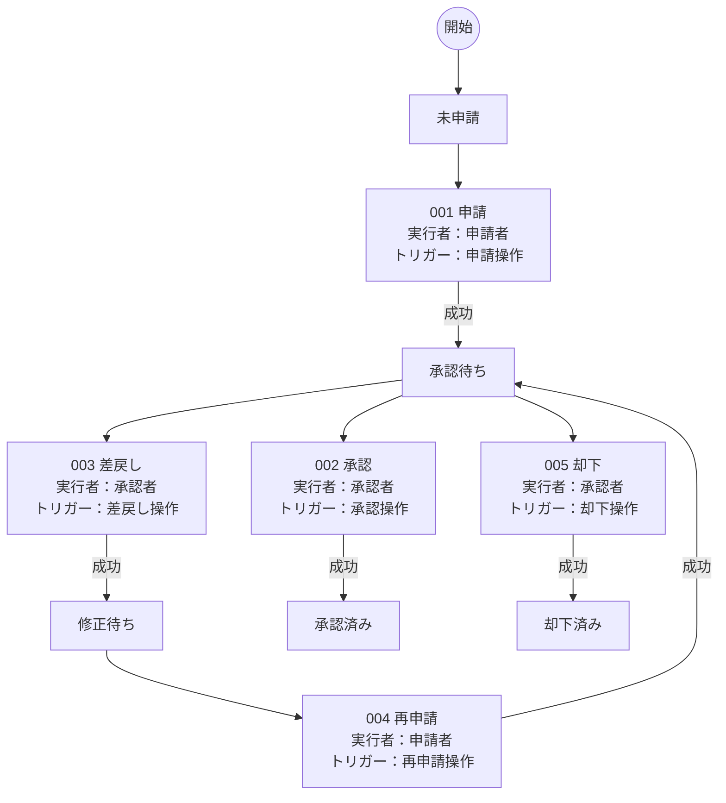

# 業務フロー図

## 申請内容の審査と再申請

```mermaid
flowchart TD
    start(("開始"))
    state_0["未申請"]
    state_1["承認待ち"]
    state_2["修正待ち"]
    state_3["承認済み"]
    state_4["却下済み"]
    start --> state_0
    action_1["001 申請<br/>実行者：申請者<br/>トリガー：申請操作"]
    state_0 --> action_1
    action_1 -->|成功| state_1
    action_2["002 承認<br/>実行者：承認者<br/>トリガー：承認操作"]
    state_1 --> action_2
    action_2 -->|成功| state_3
    action_3["003 差戻し<br/>実行者：承認者<br/>トリガー：差戻し操作"]
    state_1 --> action_3
    action_3 -->|成功| state_2
    action_4["004 再申請<br/>実行者：申請者<br/>トリガー：再申請操作"]
    state_2 --> action_4
    action_4 -->|成功| state_1
    action_5["005 却下<br/>実行者：承認者<br/>トリガー：却下操作"]
    state_1 --> action_5
    action_5 -->|成功| state_4
```

操作の番号は状態遷移表の連番に対応します。入出力・アーティファクト操作はパイプラインの詳細表を参照してください。
条件・対応パイプラインは状態遷移表に記載します。
業務上の宣言を図示しており、実行履歴や状態更新の実装済み範囲を示す図ではありません。
